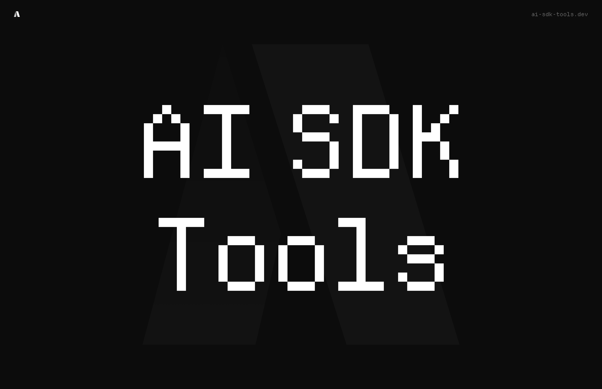

# AI SDK Tools



> **⚠️ Active Development Notice**
>
> This package is currently in **active development** and breaking changes may occur between versions. We recommend pinning to specific versions in production environments and staying updated with our changelog.

Essential utilities for building production-ready AI applications with Vercel AI SDK. State management, debugging, structured streaming, intelligent agents, caching, and persistent memory.

## Installation

### Unified Package (Recommended)

Install everything in one package:

```bash
npm install ai-sdk-tools
```

Import what you need:

```typescript
// Server-side
import { Agent, artifact, cached } from "ai-sdk-tools";

// Client-side
import { useChat, useArtifact, AIDevtools } from "ai-sdk-tools/client";
```

### Individual Packages

Or install only what you need:

### [@ai-sdk-tools/store](./packages/store)

AI chat state management that eliminates prop drilling. Clean architecture and better performance for chat components.

```bash
npm i @ai-sdk-tools/store
```

### [@ai-sdk-tools/devtools](./packages/devtools)

Development tools for debugging AI applications. Inspect tool calls, messages, and execution flow directly in your app.

```bash
npm i @ai-sdk-tools/devtools
```

### [@ai-sdk-tools/artifacts](./packages/artifacts)

Stream structured, type-safe artifacts from AI tools to React components. Build dashboards, analytics, and interactive experiences beyond chat.

```bash
npm i @ai-sdk-tools/artifacts @ai-sdk-tools/store
```

### [@ai-sdk-tools/agents](./packages/agents)

Multi-agent orchestration with automatic handoffs and routing. Build intelligent workflows with specialized agents for any AI provider. Includes a [Model Registry](./packages/agents/MODEL_REGISTRY_DESIGN.md) to decouple agents from specific providers — switch models with one env var. Provider-agnostic by design: web search, transcription, and other tool integrations each resolve their provider independently via env vars with automatic fallback.

```bash
npm i @ai-sdk-tools/agents ai zod
```

### [@ai-sdk-tools/cache](./packages/cache)

Universal caching for AI SDK tools. Cache expensive operations with zero configuration - works with regular tools, streaming, and artifacts.

```bash
npm i @ai-sdk-tools/cache
```

### [@ai-sdk-tools/memory](./packages/memory)

Persistent memory system for AI agents. Add long-term memory with support for multiple storage backends (In-Memory, Upstash Redis, Drizzle).

```bash
npm i @ai-sdk-tools/memory
```

## Getting Started

Visit our [website](https://ai-sdk-tools.dev) to explore interactive demos and detailed documentation for each package.

## Used by

<a href="https://midday.ai">
  
</a>

## Contributing to Upstream

This fork keeps the original `midday-ai/ai-sdk-tools` repository URLs in package metadata and docs. This ensures PRs to the original repo only contain your feature/fix changes, not fork-specific URL updates.

### Primary use case: Fork for our own needs

Since the upstream repo is not actively maintained, we use this fork for our project and **commit only to our own repository**. No PRs are sent most of the time. This is a valid and common approach.

**Day-to-day workflow:**

- Push all changes to `origin` (your fork)
- Develop features and fixes as needed
- Use conventional commit messages (`fix:`, `feat:`, `docs:`) – this helps if you ever contribute back

### When upstream becomes active again

If the original developer returns and you want to contribute your accumulated changes, here’s how to prepare:

**1. See what you’ve changed**

```bash
git fetch upstream
git log upstream/feature/ai-sdk-v6..HEAD --oneline   # list your commits
git diff upstream/feature/ai-sdk-v6 --stat          # files changed
```

**2. Choose an approach**

| Approach | When to use | How |
|----------|-------------|-----|
| **Split into logical PRs** | Preferred – easier to review | Group commits by topic (e.g. “store fixes”, “devtools UX”). For each group: `git checkout -b pr-store-fixes upstream/feature/ai-sdk-v6` then `git cherry-pick <commit1> <commit2>...` |
| **One PR with changelog** | Many small, related changes | Open one PR from your branch. In the description, add a clear changelog/summary of all changes so reviewers can scan it quickly |

**3. Before opening any PR**

- Rebase or merge latest `upstream/feature/ai-sdk-v6` into your branch
- Run `bun run build` and `bun run type-check`
- Remove any fork-specific changes (e.g. URLs, internal config)

**4. Open the PR**

- Base: `midday-ai/ai-sdk-tools` → `feature/ai-sdk-v6`
- Compare: your fork → your branch
- Add a concise summary and, for larger PRs, a changelog

### Remotes

- `origin` – your fork (`<your-github-username>/ai-sdk-tools`)
- `upstream` – original repo (`midday-ai/ai-sdk-tools`)

### One-time setup

```bash
git remote add upstream https://github.com/midday-ai/ai-sdk-tools.git
```

### PR workflow

1. **Sync with upstream** (before starting work):

   ```bash
   git fetch upstream
   git checkout feature/ai-sdk-v6
   git merge upstream/feature/ai-sdk-v6
   git push origin feature/ai-sdk-v6
   ```

2. **Create a feature branch** (branch from latest upstream):

   ```bash
   git checkout -b fix-some-bug upstream/feature/ai-sdk-v6
   ```

3. **Make changes, commit, push to your fork**:

   ```bash
   # edit files...
   git add .
   git commit -m "fix: description of your change"
   git push origin fix-some-bug
   ```

4. **Open the PR on GitHub**:

   - Go to https://github.com/midday-ai/ai-sdk-tools
   - GitHub will often show a "Compare & pull request" banner for your branch
   - Or: **Pull requests** → **New pull request**
   - Base: `midday-ai/ai-sdk-tools` → `feature/ai-sdk-v6`
   - Compare: `mehmetcavus/ai-sdk-tools` → `fix-some-bug`
   - Add title and description, then create the PR

### Tips

- Keep PRs small and focused (one fix or feature per PR)
- Run `bun run build` and `bun run type-check` before pushing
- Do not change `repository.url` or other `midday-ai` references in package.json – those belong to the upstream repo

## License

MIT
